<!-- Premium GitHub Profile README by Geetansh Malik -->

<p align="center">
  
</p>

<p align="center">
  
</p>

---
<!-- CONNECT -->
## 🌐 Connect With Me

<div align="center">

[](https://portfolio-seven-beta-gs0wa0mb70.vercel.app)
[](https://linkedin.com/in/geetanshmalik)
[](mailto:geetanshmalik337@gmail.com)
[](https://github.com/geetanshmalik)

</div>


---

<!-- ABOUT ME -->
## 🧠 About Me

```python
class GeetanshMalik:
    def __init__(self):
        self.name       = "Geetansh Malik"
        self.role       = "Full-Stack Developer & Agentic AI Engineer"
        self.education  = "B.Tech CSE @ VIT Bhopal (2022–2026)"
        self.location   = "Panipat, Haryana 🇮🇳"
        self.email      = "geetanshmalik337@gmail.com"
        
        self.currently_building = [
            "🤖 InterviewOS AI — Multi-Agent Interview Platform",
            "⚙️  LangGraph Orchestration Pipelines",
            "🧬 RAG Systems with ChromaDB",
        ]
        
        self.stack = {
            "languages":   ["Python", "TypeScript", "JavaScript", "SQL"],
            "frontend":    ["Next.js", "React", "React Native", "Tailwind CSS"],
            "backend":     ["FastAPI", "Node.js", "Express.js"],
            "ai_ml":       ["LangGraph", "RAG", "Machine Learning", "ChromaDB"],
            "databases":   ["PostgreSQL", "MongoDB", "Redis"],
            "devops":      ["Docker", "Linux", "Git"],
        }
        
        self.currently_learning = "Advanced Agentic AI Workflows 🔭"
        self.fun_fact = "I reduce latency before I sleep 📉"

    def say_hi(self):
        print("Let's build something amazing together! 🚀")
```

## 🛠️ Tech Arsenal

<div align="center">

### 💻 Languages


### ⚡ Frontend


### 🔧 Backend & AI


### 🗄️ Databases & DevOps


</div>


### 📊 GitHub Stats

<p align="center">
  <table border="0">
    <tr align="center">
      <td>
        
      </td>
      <td>
        
      </td>
    </tr>
    <tr align="center">
      <td colspan="2">
        <br/>
        
      </td>
    </tr>
    <tr align="center">
      <td colspan="2">
        <br/>
        <div align="center">
          
        </div>
      </td>
    </tr>
  </table>
</p>

---

### 📂 Featured Projects

*   🤖 **[InterviewAI](https://github.com/GeetanshMalik/interviewai)** — *Agentic AI Interview Platform*
    *   **Description:** Autonomous technical and HR evaluation system built using Next.js, LangGraph, and RAG.
    *   **Highlights:** Designed asynchronous multi-agent loops with Redis caching to support low-latency evaluation pipelines.
    *   **Stack:** 
             

*   🧠 **[MindSpace](https://indusapp.store/0a3iqix6)** — *Cross-Platform Wellness Application*
    *   **Description:** A complete, beautifully designed mobile app focusing on mental wellness and personal space.
    *   **Highlights:** Published on the Indus Appstore. Implemented clean modular navigation flows and reusable UI components.
    *   **Stack:** 
          

*   💻 **[CodeGenix](https://codegenix.live)** — *AI-Powered Code Compiler Platform*
    *   **Description:** Real-time multi-language compilation service with integrated AI-driven bug detection.
    *   **Highlights:** Architected microservice compiler APIs to secure and run code executions instantly.
    *   **Stack:** 
            

*   💡 **[IdeaFlux](https://ideaflux.me)** — *MERN Social Media Platform*
    *   **Description:** Full-featured social environment with stateful JWT sessions and REST endpoints.
    *   **Highlights:** Integrated an LLM caption generator to speed up workflow creation for creators.
    *   **Stack:** 
             

---

<!-- FOOTER -->
<div align="center">

```
╔════════════════════════════════════════════════════════════╗
║   "The best code is the code that ships."                  ║
║                          — Geetansh Malik                  ║
╚════════════════════════════════════════════════════════════╝
```

<p align="center">
  
</p>

<p align="center">
  
</p>
